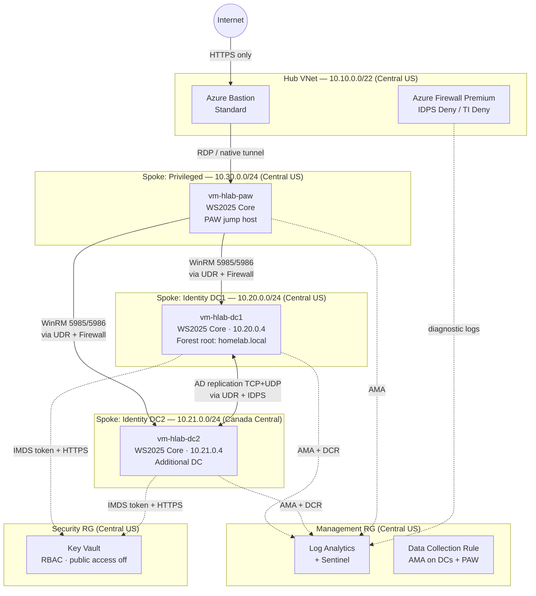

# Azure AD Landing Zone

**A production-ready Terraform landing zone that stands up a hardened, two-DC Active Directory forest on Azure in a single `make apply` — no public IPs on the domain controllers, ever.**

[](https://www.terraform.io/)
[](https://registry.terraform.io/providers/hashicorp/azurerm/latest)
[](LICENSE)

---

## Table of Contents

- [What gets deployed](#what-gets-deployed)
- [Architecture at a glance](#architecture-at-a-glance)
- [Prerequisites](#prerequisites)
- [Quickstart](#quickstart)
- [Variable reference](#variable-reference)
- [Repository layout](#repository-layout)
- [Security notes and caveats](#security-notes-and-caveats)
- [Further reading](#further-reading)

---

## What gets deployed

| Layer | Resources |
|---|---|
| **Resource groups** | Five CAF/WAF-aligned RGs: `connectivity`, `identity` (x2 regions), `management`, `security` |
| **Management plane** | Log Analytics workspace (PerGB2018, 5 GB/day cap), Data Collection Rule for Windows Security + AD + DNS logs, Microsoft Sentinel onboarded with a starter DCSync detection rule |
| **Security plane** | Key Vault (Standard, RBAC delegation, public access disabled, purge protection on) holding all DC/PAW secrets |
| **Connectivity hub** | Hub VNet (`10.10.0.0/22`, Central US) with `AzureFirewallSubnet`, `AzureBastionSubnet`, and a reserved `GatewaySubnet` |
| **Azure Firewall Premium** | IDPS mode `Deny`, threat intelligence mode `Deny`; only AD replication port set (TCP/UDP) between DCs and WinRM from the PAW plane are permitted — everything else is implicitly dropped |
| **Azure Bastion** | Standard SKU (native-client tunneling enabled); the only interactive entry point — no RDP/SSH port exposed on any VM NIC |
| **DC1 — forest root** | `vm-hlab-dc1` in Central US (`10.20.0.4`), Windows Server 2025 Datacenter Core Gen2, `Standard_B2ms`, static private IP, system-assigned managed identity |
| **DC2 — additional DC** | `vm-hlab-dc2` in Canada Central (`10.21.0.4`), identical sizing, joins the forest created by DC1 |
| **PAW spoke** | PAW VNet (`10.30.0.0/24`), `vm-hlab-paw` (`Standard_B2s`, WS2025 Core), reached only through Bastion; WinRM outbound to DCs only |
| **VNet peerings + UDRs** | Hub-to-spoke and spoke-to-hub peerings for all three spokes; every spoke has a `0.0.0.0/0` UDR pointing at the firewall private IP so spoke-to-spoke traffic (including DC replication) is forced through deep packet inspection |
| **Boot hardening** | `Harden-Server2025Core.ps1` runs before AD DS promotion: disables SMBv1/NTLMv1/TLS 1.0-1.1, enforces SMB signing + encryption, sets Windows Firewall to default-deny inbound, enables advanced audit policy |
| **DC promotion** | `Bootstrap-DomainController.ps1` retrieves the DSRM password from Key Vault via IMDS managed-identity token, installs AD DS, and promotes DC1 as forest root (`homelab.local`) then DC2 as an additional DC |

Terraform applies these in dependency order: resource groups → management → security → connectivity hub → identity spokes (DC1 then DC2) → PAW spoke → peerings.

---

## Architecture at a glance



Key traffic rules enforced by the firewall policy (all other traffic is implicitly denied):

| Direction | Allowed ports |
|---|---|
| DC1 `<->` DC2 | TCP 53, 88, 135, 139, 389, 445, 464, 636, 3268, 3269, 9389, 49152-65535; UDP 53, 88, 123, 389, 464 |
| PAW `->` DC1/DC2 | TCP 5985, 5986, 3389 |
| DCs/PAW `->` AzureCloud | TCP 443 (Key Vault, AMA, Log Analytics) |

---

## Prerequisites

| Requirement | Notes |
|---|---|
| **Terraform >= 1.5** | `terraform -version` to verify |
| **Azure CLI** | `az --version`; used for `az login` authentication |
| **Azure subscription** | Owner or Contributor + User Access Administrator role on the target subscription (required for Key Vault RBAC role assignments) |
| **Quota** | At least 6 vCPUs of `Standard_B` series available in Central US; 2 in Canada Central. Azure Firewall Premium counts against regional SKU limits. |
| **Optional: `tflint`, `checkov`, `tfsec`** | Required only for `make lint` and `make scan`; not needed for a plain apply |

---

## Quickstart

```bash
# 1. Clone the repo
git clone <repo-url> azure-ad-landing-zone
cd azure-ad-landing-zone

# 2. Fill in your subscription and tenant IDs
cp terraform.tfvars.example terraform.tfvars
# Edit terraform.tfvars — at minimum set subscription_id and tenant_id.
# Restrict allowed_paw_source_cidrs to your operator egress IP(s).

# 3. Authenticate to Azure
az login
az account set --subscription "<your-subscription-id>"

# 4. Deploy
make init    # terraform init
make plan    # terraform fmt + validate + plan -out=tfplan
make apply   # terraform apply tfplan
```

After a successful apply, Terraform prints operator-facing outputs:

```
domain_fqdn           = "homelab.local"
dc1_private_ip        = "10.20.0.4"
dc2_private_ip        = "10.21.0.4"
firewall_private_ip   = "<firewall-private-ip>"
key_vault_uri         = "https://kv-hlab-prod-cus.vault.azure.net/"
sentinel_workspace_id = "<workspace-id>"
paw_private_ip        = "<dynamic-private-ip>"
connect_hint          = "Azure Bastion -> PAW (<paw-ip>) -> WinRM to DC1/DC2. No DC is internet-facing."
```

**To reach the environment:** open the Azure portal, navigate to the Bastion host in the `rg-hlab-connectivity-prod-cus` resource group, and connect to the PAW VM. From the PAW, use PowerShell remoting (`Enter-PSSession`) to manage DC1 or DC2.

### Raw Terraform (without Make)

```bash
terraform init
terraform fmt -recursive
terraform validate
terraform plan -out=tfplan
terraform apply tfplan
```

### Available Make targets

| Target | What it does |
|---|---|
| `make init` | `terraform init` |
| `make fmt` | `terraform fmt -recursive` |
| `make validate` | fmt then `terraform validate` |
| `make lint` | `tflint --recursive` (requires tflint) |
| `make scan` | `checkov` + `tfsec` static analysis (non-blocking) |
| `make plan` | validate then `terraform plan -out=tfplan` |
| `make apply` | `terraform apply tfplan` |
| `make destroy` | `terraform destroy` |

---

## Variable reference

All variables are defined in `variables.tf`. The two required variables (no defaults) are `subscription_id` and `tenant_id`. Everything else ships with cost-optimized lab defaults.

| Variable | Default | Description |
|---|---|---|
| `subscription_id` | _(required)_ | Target Azure subscription ID |
| `tenant_id` | _(required)_ | Entra ID tenant ID hosting the deployment |
| `org_prefix` | `"hlab"` | Short prefix used in all resource names (2-6 lowercase alphanumeric chars) |
| `environment` | `"prod"` | Environment short name, appears in resource names |
| `primary_location` | `"centralus"` | Azure region for the hub, DC1, management, and security resources |
| `secondary_location` | `"canadacentral"` | Azure region for DC2 |
| `ad_domain_name` | `"homelab.local"` | AD forest root FQDN |
| `ad_netbios_name` | `"HOMELAB"` | AD NetBIOS domain name |
| `hub_address_space` | `["10.10.0.0/22"]` | Hub VNet CIDR |
| `spoke_dc1_address_space` | `["10.20.0.0/24"]` | DC1 spoke VNet CIDR (DC1 gets `.4`) |
| `spoke_dc2_address_space` | `["10.21.0.0/24"]` | DC2 spoke VNet CIDR (DC2 gets `.4`) |
| `privileged_address_space` | `["10.30.0.0/24"]` | PAW spoke VNet CIDR |
| `dc_vm_size` | `"Standard_B2ms"` | VM size for both domain controllers (2 vCPU / 8 GiB) |
| `paw_vm_size` | `"Standard_B2s"` | VM size for the PAW jump host |
| `firewall_sku_tier` | `"Premium"` | Firewall tier — must remain `"Premium"` for IDPS/TLS inspection |
| `log_retention_days` | `90` | Log Analytics and Sentinel data retention in days |
| `admin_username` | `"lzadmin"` | Local admin username injected at VM build; rotated post-promotion |
| `allowed_paw_source_cidrs` | `["0.0.0.0/0"]` | CIDRs permitted to reach Azure Bastion — **tighten this before use** |
| `tags` | see `variables.tf` | Base tags merged onto every resource |

---

## Repository layout

```
azure-ad-landing-zone/
├── main.tf                          # Root composition — wires all modules
├── variables.tf                     # All input variables with defaults
├── locals.tf                        # CAF naming convention, derived values
├── outputs.tf                       # Operator-facing outputs after apply
├── terraform.tfvars.example         # Copy to terraform.tfvars and fill in
├── Makefile                         # init / fmt / validate / lint / scan / plan / apply / destroy
│
├── modules/
│   ├── resource-groups/             # Five WAF-aligned resource groups
│   ├── log-analytics/               # Log Analytics workspace + Windows DCR
│   ├── sentinel/                    # Sentinel onboarding + starter DCSync alert rule
│   ├── key-vault/                   # Key Vault (RBAC, no public access, purge protection)
│   ├── networking-hub/              # Hub VNet (AzureFirewallSubnet, AzureBastionSubnet, GatewaySubnet)
│   │   └── peering/                 # Bidirectional hub <-> spoke VNet peerings
│   ├── azure-firewall/              # Azure Firewall Premium, IDPS Deny, AD + WinRM rule collections
│   ├── bastion/                     # Azure Bastion Standard (native-client tunneling)
│   ├── domain-controller/           # Spoke VNet, NSG, UDR, WS2025 Core DC VM, AMA, bootstrap
│   │   └── scripts/
│   │       ├── Bootstrap-DomainController.ps1   # DSRM retrieval + AD DS role + forest/join
│   │       └── Harden-Server2025Core.ps1        # CIS-style pre-promotion hardening baseline
│   └── networking-spoke/            # PAW spoke VNet, NSG, UDR, PAW jump host VM
│
└── docs/
    ├── architecture.md              # Detailed design decisions and network diagram
    └── deployment.md                # Step-by-step deployment runbook
```

---

## Security notes and caveats

**Tighten `allowed_paw_source_cidrs` immediately.**
The default is `0.0.0.0/0`, which allows any IP to initiate a Bastion session. Before applying to any environment connected to real infrastructure, replace this with your operator's egress IP(s), e.g. `["203.0.113.10/32"]`. This is the single most important configuration change.

**Host the bootstrap scripts in a private storage account.**
The `CustomScriptExtension` `fileUris` list in `modules/domain-controller/main.tf` is intentionally left empty in this repo — the scripts live under `modules/domain-controller/scripts/`. For a real deployment, upload the PowerShell scripts to a private Azure Blob Storage account with a short-lived SAS token or a managed identity-accessible URL. Do not serve them from a public URL.

**Azure Firewall Premium is the dominant cost driver.**
The Premium tier costs approximately $1.25/hour (roughly $900/month) plus $0.016/GB of data processed, regardless of whether IDPS rules fire. If budget is a primary constraint, you can set `firewall_sku_tier = "Standard"` — but doing so disables IDPS and TLS deep packet inspection, which are central to the security design. The `intrusion_detection` block in the firewall module is conditioned on `sku_tier == "Premium"` and will simply be omitted at Standard tier without breaking the plan.

**No public IPs on DCs or PAW — by design.**
DC NICs use static private IPs with no `public_ip_address_id`. The PAW NIC uses dynamic private allocation with no public IP. The only internet-facing resources are the Azure Firewall public IP (for SNAT egress) and the Bastion public IP. Do not add public IPs to DC or PAW NICs.

**Secrets never appear in Terraform state outputs.**
DSRM and local admin passwords are generated by `random_password` and written directly to Key Vault secrets. They are stored in state as sensitive values (not output blocks). DC VMs read secrets at boot via IMDS managed-identity token — no password appears in the Custom Script Extension command visible in the portal.

**Hardening baseline is a starting point.**
`Harden-Server2025Core.ps1` covers the quick wins (SMBv1, NTLMv1, TLS 1.0/1.1, SMB signing, Windows Firewall default-deny, advanced audit policy). It is explicitly not a full CIS Level 2 implementation. Extend it with the official Microsoft Security Baseline GPOs or CIS-CAT tooling once the domain is operational.

**`terraform destroy` is destructive and irreversible.**
The Key Vault has `purge_protection_enabled = true` and a 90-day soft-delete window. After `destroy`, secrets will be soft-deleted but the vault name will remain reserved for 90 days. Plan for this if you intend to redeploy with the same `org_prefix`.

---

## Further reading

- [docs/architecture.md](docs/architecture.md) — Full design rationale: hub-and-spoke topology decisions, IDPS rule set reasoning, Key Vault RBAC delegation model, Sentinel data connector and alert rule design
- [docs/deployment.md](docs/deployment.md) — Step-by-step deployment runbook: pre-flight checklist, first-login procedures, post-promotion validation, PAW-to-DC WinRM connection guide, common troubleshooting
