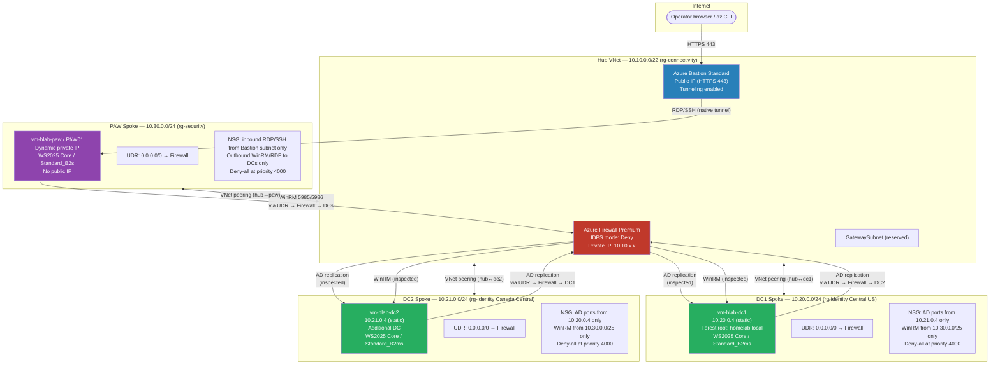
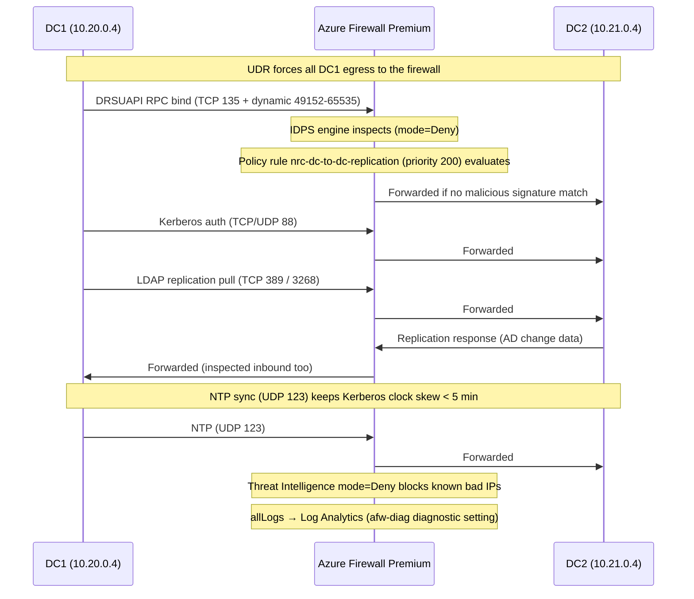
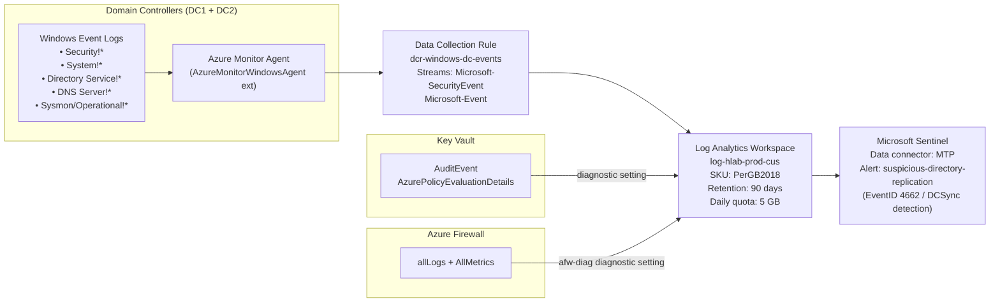

# Architecture: Azure AD Landing Zone

A hub-and-spoke Active Directory landing zone for `homelab.local`, built on Azure Firewall Premium with IDPS, Azure Bastion, and Microsoft Sentinel. All spoke-to-spoke traffic — including AD replication between domain controllers — transits the firewall for deep packet inspection. No public IP lands on any domain controller or privileged-access workstation.

---

## Table of contents

1. [Resource group layout](#resource-group-layout)
2. [Network topology](#network-topology)
3. [AD replication traffic flow](#ad-replication-traffic-flow)
4. [Operator access path](#operator-access-path)
5. [Secret lifecycle](#secret-lifecycle)
6. [Monitoring and detection pipeline](#monitoring-and-detection-pipeline)
7. [Firewall and NSG port reference](#firewall-and-nsg-port-reference)
8. [Forest and DC design](#forest-and-dc-design)
9. [VM and storage configuration](#vm-and-storage-configuration)
10. [Cost-optimization choices](#cost-optimization-choices)
11. [Deployment order](#deployment-order)
12. [Known caveats](#known-caveats)

---

## Resource group layout

Five resource groups, aligned to the Azure Cloud Adoption Framework (CAF) landing-zone functions. The naming pattern is `rg-<org_prefix>-<function>-<env>-<region_abbr>`.

| Logical key | CAF function | Default name (org_prefix=hlab, env=prod) | Region |
|---|---|---|---|
| `connectivity` | Hub networking, firewall, Bastion | `rg-hlab-connectivity-prod-cus` | Central US |
| `identity_dc1` | DC1 spoke VNet + VM | `rg-hlab-identity-prod-cus` | Central US |
| `identity_dc2` | DC2 spoke VNet + VM | `rg-hlab-identity-prod-cnc` | Canada Central |
| `management` | Log Analytics + Sentinel | `rg-hlab-management-prod-cus` | Central US |
| `security` | Key Vault + PAW spoke | `rg-hlab-security-prod-cus` | Central US |

The `management` and `security` groups deliberately separate operational logging from secret storage, matching the CAF pattern of independent management and security planes.

---

## Network topology



Key peering facts from the code:
- Spokes are peered **only with the hub**, never with each other (`allow_forwarded_traffic = true`, `allow_gateway_transit = true` on hub side).
- Every spoke subnet has a UDR with a single `0.0.0.0/0 → VirtualAppliance → <firewall_private_ip>` route, forcing all egress (including inter-spoke) through the firewall.
- The `GatewaySubnet` is provisioned but no gateway is deployed — reserved for future ExpressRoute or VPN.

---

## AD replication traffic flow

The sequence below traces a single AD replication cycle from DC1 to DC2. The same path applies in reverse and for Kerberos authentication between DCs.



Both NSGs (on DC1 and DC2 subnets) enforce the same port list as the firewall rules, providing a second layer of scope control. Traffic that is blocked by the NSG never even reaches the firewall.

---

## Operator access path

There are no public IPs on the DCs or the PAW. The only internet-reachable endpoint is Azure Bastion's public IP.

```mermaid
sequenceDiagram
    participant OPS as Operator (browser / az CLI)
    participant BAS as Azure Bastion (Standard SKU)
    participant PAW as PAW VM (PAW01 / 10.30.0.x)
    participant FW as Azure Firewall Premium
    participant DC as DC1 or DC2

    OPS->>BAS: HTTPS 443 (portal or native client tunnel)
    Note over BAS: Bastion terminates TLS; RDP/SSH never exposed to internet
    BAS->>PAW: RDP TCP 3389 or SSH 22 (Bastion subnet → PAW NSG rule priority 100)
    Note over PAW: Operator lands on GUI-less WS2025 Core jump host
    PAW->>FW: WinRM TCP 5985 / 5986 (PAW UDR forces via firewall)
    Note over FW: nrc-paw-to-dc-winrm rule (priority 300) allows; IDPS inspects
    FW->>DC: WinRM forwarded to DC private IP
    DC-->>FW: WinRM response
    FW-->>PAW: Response forwarded
```

The PAW NSG (`nsg-hlab-paw-prod-cus`) blocks all inbound traffic except from the Bastion subnet (`AzureBastionSubnet` prefix). Outbound is restricted to ports 5985, 5986, 3389 toward DC address spaces plus TCP 443 to `AzureCloud` for platform services.

---

## Secret lifecycle

Terraform generates all secrets; they are stored in Key Vault and read by VMs at bootstrap time using their system-assigned managed identity. Secrets never appear in Terraform output blocks or on disk in cleartext beyond the transient script run.

```mermaid
sequenceDiagram
    participant TF as Terraform
    participant KV as Key Vault (RBAC, no public access)
    participant IMDS as Azure IMDS (169.254.169.254)
    participant VM as DC VM (managed identity)
    participant CSE as Custom Script Extension

    TF->>TF: random_password (28 chars, mixed complexity) for local_admin + DSRM
    TF->>KV: azurerm_key_vault_secret — stores local-admin, dsrm, domain-admin
    Note over TF,KV: Deploying principal holds Key Vault Secrets Officer
    TF->>VM: azurerm_role_assignment — Key Vault Secrets User scoped to KV
    Note over VM: VM boots; CustomScriptExtension launches Bootstrap-DomainController.ps1

    CSE->>IMDS: GET /metadata/identity/oauth2/token (resource=vault.azure.net)
    IMDS-->>CSE: AAD access token (MSI credential)
    CSE->>KV: GET /secrets/<dsrm-secret>?api-version=7.4  (Bearer token)
    KV-->>CSE: Secret value
    Note over CSE: DC2 also fetches 'domain-admin' secret the same way
    CSE->>VM: Install-ADDSForest / Install-ADDSDomainController (DSRM password injected as SecureString)
    Note over VM: admin_password lifecycle { ignore_changes } — Terraform no longer manages it after first apply
```

Key Vault configuration enforced in code:
- `enable_rbac_authorization = true` — no vault access policies exist
- `public_network_access_enabled = false`
- `purge_protection_enabled = true`, `soft_delete_retention_days = 90`
- `network_acls.default_action = "Deny"`, `bypass = "AzureServices"`
- All Key Vault audit events (`AuditEvent`, `AzurePolicyEvaluationDetails`) stream to Log Analytics

---

## Monitoring and detection pipeline



The built-in Sentinel scheduled rule `suspicious-directory-replication` fires on EventID 4662 where the `DS-Replication-Get-Changes` or `DS-Replication-Get-Changes-All` extended right is referenced by a non-machine account — the canonical DCSync indicator. It queries hourly with a 1-hour lookback and is tagged `CredentialAccess` severity High.

---

## Firewall and NSG port reference

Both the firewall policy (`azure-firewall/main.tf`) and the DC NSGs (`domain-controller/main.tf`) enforce the same port lists independently. The table below is pulled directly from `locals` in both files.

### TCP ports (AD replication, DCOM/RPC, LDAP)

| Port | Protocol | Purpose |
|---|---|---|
| 53 | TCP | DNS |
| 88 | TCP | Kerberos authentication |
| 135 | TCP | RPC endpoint mapper (DCOM) |
| 139 | TCP | NetBIOS session service |
| 389 | TCP | LDAP |
| 445 | TCP | SMB (SYSVOL/NETLOGON replication) |
| 464 | TCP | Kerberos password change (kpasswd) |
| 636 | TCP | LDAPS |
| 3268 | TCP | Global Catalog |
| 3269 | TCP | Global Catalog SSL |
| 9389 | TCP | AD DS Web Services (ADWS) |
| 49152-65535 | TCP | RPC dynamic / DRSUAPI high ports |

### UDP ports (Kerberos, DNS, NTP, LDAP ping)

| Port | Protocol | Purpose |
|---|---|---|
| 53 | UDP | DNS |
| 88 | UDP | Kerberos |
| 123 | UDP | NTP (Kerberos clock skew < 5 min) |
| 389 | UDP | LDAP ping / CLDAP |
| 464 | UDP | Kerberos password change |

### Management / access ports (PAW → DCs, Bastion → PAW)

| Port | Protocol | Rule | Source |
|---|---|---|---|
| 5985 | TCP | WinRM HTTP | PAW subnet → DCs (firewall priority 300, NSG priority 100/100) |
| 5986 | TCP | WinRM HTTPS | PAW subnet → DCs |
| 3389 | TCP | RDP (fallback) | PAW subnet → DCs; Bastion subnet → PAW |
| 22 | TCP | SSH | Bastion subnet → PAW |
| 443 | TCP | HTTPS (platform) | DCs and PAW → AzureCloud (Key Vault, AMA) |

---

## Forest and DC design

| Attribute | DC1 | DC2 |
|---|---|---|
| `dc_role` | `forest_root` | `additional_dc` |
| Promotion cmdlet | `Install-ADDSForest` | `Install-ADDSDomainController` |
| Forest FQDN | `homelab.local` | joins `homelab.local` |
| NetBIOS name | `HOMELAB` | `HOMELAB` |
| Forest / domain functional level | `WinThreshold` (Windows Server 2016+) | — |
| DNS integrated | Yes (`-InstallDns:$true`) | Yes |
| Private IP | 10.20.0.4 (static) | 10.21.0.4 (static) |
| Region | Central US | Canada Central |
| Terraform `depends_on` | — | `[module.dc1]` |

DC2 retrieves the domain-admin credential from Key Vault (secret `domain-admin`, seeded by DC1's module when `dc_role == "forest_root"`) at bootstrap time. The credential never passes through Terraform variables or state outputs.

The IPs are derived at the root level using `cidrhost()`:

```hcl
dc_private_ip      = cidrhost(var.spoke_dc1_address_space[0], 4)  # 10.20.0.4
peer_dc_private_ip = cidrhost(var.spoke_dc2_address_space[0], 4)  # 10.21.0.4
```

---

## VM and storage configuration

All VMs (DC1, DC2, PAW) share the same baseline configuration:

| Attribute | Value |
|---|---|
| Image | `MicrosoftWindowsServer / WindowsServer / 2025-datacenter-core-g2` |
| Generation | Gen 2 (UEFI) |
| Secure Boot | Enabled |
| vTPM | Enabled (Trusted Launch) |
| OS disk | `StandardSSD_LRS` |
| Disk caching | ReadWrite |
| Public IP | None (DCs and PAW) |
| VM agent | `provision_vm_agent = true` |
| Identity | `SystemAssigned` managed identity |

VM sizes (overridable via variables):

| VM | Default size | vCPU | RAM |
|---|---|---|---|
| DC1, DC2 | `Standard_B2ms` | 2 | 8 GiB |
| PAW | `Standard_B2s` | 2 | 4 GiB |

### Hardening baseline (Harden-Server2025Core.ps1)

Applied before AD DS promotion on every DC:

- SMBv1 disabled (both `Disable-WindowsOptionalFeature` and `Set-SmbServerConfiguration`)
- SMB signing required, SMB encryption enforced
- TLS 1.0 and TLS 1.1 disabled via registry (both server and client roles)
- `LmCompatibilityLevel = 5` (NTLMv2 only), LM hash storage disabled, anonymous access restricted
- Advanced audit policy enabled for: Logon/Logoff, Account Logon, Account Management, DS Access, Policy Change, Privilege Use, Detailed Tracking
- Process command-line auditing enabled (high-value for Sentinel enrichment)
- Windows Firewall set to default-deny inbound on all profiles
- Unnecessary services disabled (Spooler, Xbox, Maps)
- Local password policy: 14-char minimum, 60-day max age, 24-password history, 5-attempt lockout

---

## Cost-optimization choices

| Choice | Rationale |
|---|---|
| `Standard_B2ms` / `Standard_B2s` | Burstable B-series VMs cost significantly less than D/E-series at low steady-state CPU. Adequate for a lab domain with burst headroom. |
| `StandardSSD_LRS` OS disk | Lower cost than `Premium_SSD_LRS`; sufficient IOPS for a DC with light load. |
| Windows Server 2025 **Core** (no GUI) | Eliminates Desktop Experience license overhead and reduces the OS attack surface. All management is via PowerShell remoting / RSAT from the PAW. |
| Log Analytics `PerGB2018` SKU | Pay-as-you-go; no commitment tier required for lab-scale ingestion. |
| Log Analytics `daily_quota_gb = 5` | Hard cap at 5 GB/day prevents runaway ingestion cost. Raise this before enabling high-volume data sources. |
| Log retention 90 days | Minimum for Sentinel alert correlation; increase to 180+ days for compliance use cases. |
| Firewall SKU `Premium` | Required for IDPS; there is no cost-down option here without sacrificing the core security control. |

---

## Deployment order

Terraform resolves the dependency graph automatically. The explicit sequence as documented in `main.tf` is:

1. `module.resource_groups` — all five RGs must exist before anything else
2. `module.log_analytics` and `module.sentinel` — management plane
3. `module.key_vault` — security plane (needs Log Analytics for diagnostics)
4. `module.hub`, `module.firewall`, `module.bastion` — connectivity hub
5. `module.dc1` — forest root DC (needs hub, firewall, Key Vault, Log Analytics)
6. `module.dc2` — additional DC (`depends_on = [module.dc1]` is explicit)
7. `module.paw_spoke` — privileged plane
8. `module.peerings` — hub↔spoke VNet peerings (needs all VNet IDs)

---

## Known caveats

**CustomScriptExtension script hosting.** The `fileUris` array in `azurerm_virtual_machine_extension.bootstrap` is empty in this repository. In production, the `.ps1` scripts must be hosted in a private Azure Blob Storage container (or Azure Files share) and referenced with a SAS token or managed identity, not fetched from a public URL or local disk. Without a reachable `fileUri`, the extension will fail silently and the DC will not be promoted. See `modules/domain-controller/main.tf` line 356 for the placeholder comment.

**`allowed_paw_source_cidrs` default is `0.0.0.0/0`.** The variable that gates access to Azure Bastion defaults to any IP. This must be restricted to operator egress CIDR(s) before this environment is treated as production. The comment in `variables.tf` calls this out explicitly.

**`admin_password` rotation.** Terraform sets `lifecycle { ignore_changes = [admin_password] }` on DC and PAW VMs. After the first apply, the local admin password is managed entirely through Key Vault. Drift between the VM's actual password and the Key Vault secret is possible if rotation is performed outside Terraform. Use a documented rotation runbook (see `docs/deployment.md`).

**Forest functional level.** `WinThreshold` maps to Windows Server 2016 functional level (the highest available at the time of Server 2025 GA). This is the correct choice for a new forest and enables all modern AD features including Protected Users, Authentication Policies, and PKI improvements.

**Sentinel data connector.** The `azurerm_sentinel_data_connector_microsoft_threat_protection` resource enables the Microsoft Defender XDR connector. This requires a Microsoft 365 Defender / Defender XDR license. For a lab without that license, remove or comment out the `mtp` resource in `modules/sentinel/main.tf`; the DCR-based Windows event ingestion pipeline works independently.
